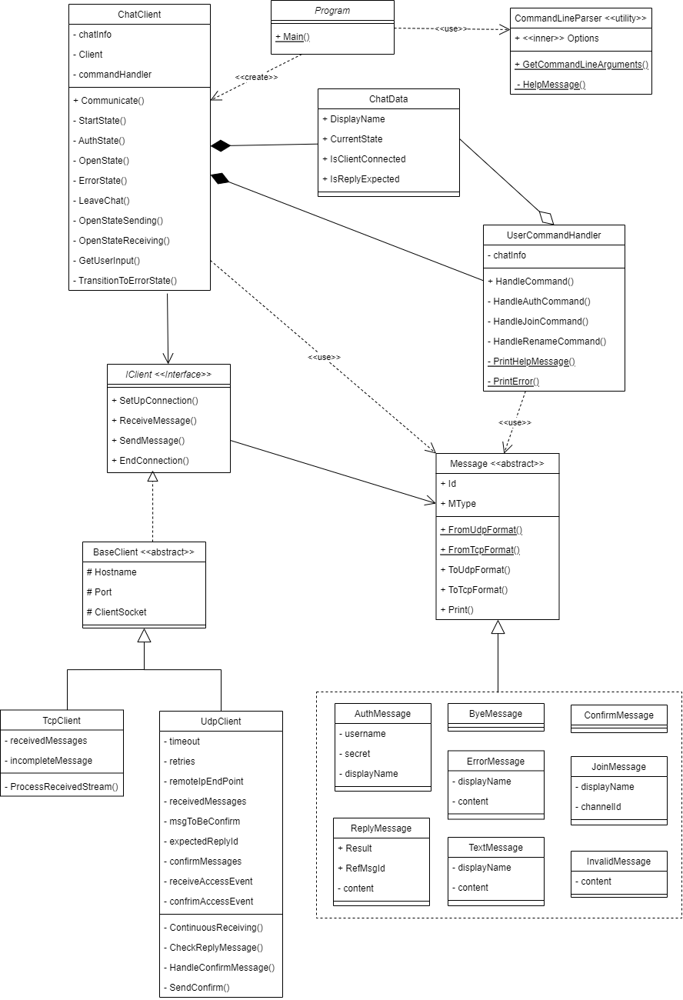

# IPK-Project1

## Spustenie:

### Linux a Windows
```bash
cd ChatApp
dotnet run -- -t <protocol> -s <hostname> [-p <port>] [-r <retries>] [-d <timeout>] [-v] 
```

Pomocou `Makefile`
```bash
make
./ipk24chat-client -t <protocol> -s <hostname> [-p <port>] [-r <retries>] [-d <timeout>] [-v] 
```

#### Parametre

- `-t <protocol>`: protokol použitý pri komunikácii, podporované sú `tcp`|`udp`,
- `-s <hostname>`: adresa servera,
- `-p <port>`: (Optional) port serveru,
- `-r <retries>`: (Optional) počet pokusov na opätovné zaslanie správy pri nepotvrdení,
- `-r <timeout>`: (Optional) maximálny čas na potvrdenie správy od serveru [ms],
- `-v`: (Optional) logovanie do štandardného chybového výstupu.

### Testy
```bash
dotnet test
```

Pomocou `Makefile`
```bash
make test
```

## UML diagram


*Poznámka:*
- Každá správa v `--` štvorci dedí od `Message`.
- Uvedený diagram tried poukazuje iba na triedy relevantné k samotnej implementácii protokolu `IPK24-CHAT`. V diagrame nie sú triedy použité pre logovanie (`Logger`) a testovanie (`UdpServer`, `TcpServer` a `ChatSimulator`).

## Správy

Správy sú navrhnuté tak, že všetky typy správ podporované `IPK24-CHAT` protokolom dedia od abstraktnej triedy `Message`. Táto trieda `Message` obsahuje spoločné atribúty a metódy pre všetky typy správ. 

Spoločné atribúty:
- `Id` - identifikátor správy
- `MType` - Typ správy: `ERR`, `MSG`, `Confirm` ...

Spoločné metódy
- `ToUdpFormat` - serializácia danej správy do TCP formátu definovaného v `IPK24-CHAT`,
- `ToTcpFormat` - serializácia danej správy do UDP formátu definovaného v `IPK24-CHAT`,
- `Print` - výpis správy na štandardný (prípadne chybový) výstup tak, ako to vyžaduje `IPK24-CHAT`.

Mimo týchto metód trieda `Message` implementuje továrenské metódy `FromTcpFormat` a `FromUdpFormat` na vytvorenie daného typu správy z TCP aj UDP formátu správy.

`InvalidMessage` predstavuje internú reprezentáciu nevalidnej správy od serveru. Môže to byť napríklad dôsledkom nesprávneho formátu TCP/UDP správy, prípadne pri obdržaní `ReplyMessage` z nesprávnym referenčným indexom `RefMsgId`.

### Testy

Testované boli serializácia, deserializácia a vypisovanie správ na štandardný alebo chybový výstup:

#### Výpis správ

Testuje, či správy boli užívateľovi vypísané v správnom formáte.

*MessagePrintingTests.cs*

<style type="text/css">
.tg  {border-collapse:collapse;border-spacing:0;margin:0px auto;}
.tg td{border-color:black;border-style:solid;border-width:1px;font-family:Arial, sans-serif;font-size:14px;
  overflow:hidden;padding:10px 5px;word-break:normal;}
.tg th{border-color:black;border-style:solid;border-width:1px;font-family:Arial, sans-serif;font-size:14px;
  font-weight:normal;overflow:hidden;padding:10px 5px;word-break:normal;}
.tg .tg-v0hj{background-color:#efefef;border-color:inherit;font-weight:bold;text-align:center;vertical-align:top}
.tg .tg-mzcb{background-color:#fbe9e9;border-color:inherit;text-align:left;vertical-align:top}
.tg .tg-6opx{background-color:#f3fded;border-color:inherit;text-align:left;vertical-align:top}
</style>
<table class="tg">
<thead>
  <tr>
    <th class="tg-v0hj">Intern message representation</th>
    <th class="tg-v0hj">Output</th>
  </tr>
</thead>
<tbody>
  <tr>
    <td class="tg-mzcb">ErrorMessage(DisplayName: "TestUser", Content: "test message")</td>
    <td class="tg-mzcb">"ERR FROM TestUser: test message"</td>
  </tr>
  <tr>
    <td class="tg-mzcb">ReplyMessage(ReplyResult.Ok, Content: "OK")</td>
    <td class="tg-mzcb">"Success: OK"</td>
  </tr>
  <tr>
    <td class="tg-mzcb">ReplyMessage(ReplyResult.Nok, Content: "NOK")</td>
    <td class="tg-mzcb">"Failure: NOK"</td>
  </tr>
  <tr>
    <td class="tg-6opx">TextMessage("TestUser", "test content")</td>
    <td class="tg-6opx">"TestUser: test content"</td>
  </tr>
</tbody>
</table>

<br>

#### TCP

Spoločné testy pre TCP na serializáciu aj deserializáciu:

*TcpMessageCoding.cs*

<style type="text/css">
.tg  {border-collapse:collapse;border-spacing:0;margin:0px auto;}
.tg td{border-color:black;border-style:solid;border-width:1px;font-family:Arial, sans-serif;font-size:14px;
  overflow:hidden;padding:10px 5px;word-break:normal;}
.tg th{border-color:black;border-style:solid;border-width:1px;font-family:Arial, sans-serif;font-size:14px;
  font-weight:normal;overflow:hidden;padding:10px 5px;word-break:normal;}
.tg .tg-v0hj{background-color:#efefef;border-color:inherit;font-weight:bold;text-align:center;vertical-align:top}
.tg .tg-0pky{border-color:inherit;text-align:left;vertical-align:top}
</style>
<table class="tg">
<thead>
  <tr>
    <th class="tg-v0hj">Intern message representation</th>
    <th class="tg-v0hj">TCP format</th>
  </tr>
</thead>
<tbody>
  <tr>
    <td class="tg-0pky">AuthMessage("test", "secret", "Display_name")</td>
    <td class="tg-0pky">"AUTH test AS Display_name USING secret\r\n"</td>
  </tr>
  <tr>
    <td class="tg-0pky">JoinMessage("channel", "Display_name")</td>
    <td class="tg-0pky">"JOIN channel AS Display_name\r\n"</td>
  </tr>
  <tr>
    <td class="tg-0pky">TextMessage(DisplayName: "Display_name", Content: "test message")</td>
    <td class="tg-0pky">"MSG FROM Display_name IS test message\r\n"</td>
  </tr>
  <tr>
    <td class="tg-0pky">ErrorMessage(DisplayName: "Display_name", Content: "test message")</td>
    <td class="tg-0pky">"ERR FROM Display_name IS test message\r\n"</td>
  </tr>
  <tr>
    <td class="tg-0pky">ReplyMessage(ReplyResult.Ok, "Ok")</td>
    <td class="tg-0pky">"REPLY OK IS Ok\r\n"</td>
  </tr>
  <tr>
    <td class="tg-0pky">ReplyMessage(ReplyResult.Nok, "Nok")</td>
    <td class="tg-0pky">"REPLY NOK IS Nok\r\n"</td>
  </tr>
</tbody>
</table>

<br>

Ďalšie testy pre deserializáciu. Snahou je najmä overiť možnosť prijímania TCP správ v `CASE INSENSITIVE` formáte.

*TcpMessageCoding.cs*

<style type="text/css">
.tg  {border-collapse:collapse;border-spacing:0;margin:0px auto;}
.tg td{border-color:black;border-style:solid;border-width:1px;font-family:Arial, sans-serif;font-size:14px;
  overflow:hidden;padding:10px 5px;word-break:normal;}
.tg th{border-color:black;border-style:solid;border-width:1px;font-family:Arial, sans-serif;font-size:14px;
  font-weight:normal;overflow:hidden;padding:10px 5px;word-break:normal;}
.tg .tg-v0hj{background-color:#efefef;border-color:inherit;font-weight:bold;text-align:center;vertical-align:top}
.tg .tg-0pky{border-color:inherit;text-align:left;vertical-align:top}
</style>
<table class="tg">
<thead>
  <tr>
    <th class="tg-v0hj">Intern message representation</th>
    <th class="tg-v0hj">TCP format</th>
  </tr>
</thead>
<tbody>
  <tr>
    <td class="tg-0pky">InvalidMessage("INVALID MESSAGE")</td>
    <td class="tg-0pky">"REPLY XXX IS Ok\r\n"</td>
  </tr>
  <tr>
    <td class="tg-0pky">ReplyMessage(ReplyResult.Nok, "Nok")</td>
    <td class="tg-0pky">"rePly nOk Is Nok\r\n"</td>
  </tr>
  <tr>
    <td class="tg-0pky">ErrorMessage(DisplayName: "Display_name", Content: "test message")</td>
    <td class="tg-0pky">"ErR fROm Display_name iS test message\r\n"</td>
  </tr>
  <tr>
    <td class="tg-0pky">ByeMessage()</td>
    <td class="tg-0pky">"Bye\r\n"</td>
  </tr>
</tbody>
</table>

<br><br>

#### UDP

Testy pre serializáciu a deserializáciu UDP správ. Okrem formátu správy overuje serializovanie aj deserializovanie do `Network byte order`, to sa týka `Id` a `RefMsgId`.

*UdpMessageCoding.cs*
<style type="text/css">
.tg  {border-collapse:collapse;border-spacing:0;margin:0px auto;}
.tg td{border-color:black;border-style:solid;border-width:1px;font-family:Arial, sans-serif;font-size:14px;
  overflow:hidden;padding:10px 5px;word-break:normal;}
.tg th{border-color:black;border-style:solid;border-width:1px;font-family:Arial, sans-serif;font-size:14px;
  font-weight:normal;overflow:hidden;padding:10px 5px;word-break:normal;}
.tg .tg-pg6v{background-color:#EFEFEF;border-color:inherit;font-weight:bold;text-align:center;vertical-align:top}
.tg .tg-0pky{border-color:inherit;text-align:left;vertical-align:top}
</style>
<table class="tg">
<thead>
  <tr>
    <th class="tg-pg6v">Intern message representation</th>
    <th class="tg-pg6v">UDP format</th>
  </tr>
</thead>
<tbody>
  <tr>
    <td class="tg-0pky">AuthMessage("name", "pass", "alias",<span style="color:#009901"> Id: 1</span>)</td>
    <td class="tg-0pky">02 <span style="color:#009901">00 01</span> 6E 61 6D 65 <span style="color:#FE0000">00</span> 61 6C 69 61 73 <span style="color:#FE0000">00</span> 70 61 73 73 <span style="color:#FE0000">00</span></td>
  </tr>
  <tr>
    <td class="tg-0pky">JoinMessage("general", "alias", <span style="color:#009901">Id: 2</span>)</td>
    <td class="tg-0pky">03 <span style="color:#009901">00 02</span> 67 65 6E 65 72 61 6C <span style="color:#FE0000">00</span> 61 6C 69 61 73 <span style="color:#FE0000">00</span></td>
  </tr>
  <tr>
    <td class="tg-0pky">ByeMessage(<span style="color:#009901">Id: 3)</span></td>
    <td class="tg-0pky">FF <span style="color:#009901">00 03</span></td>
  </tr>
  <tr>
    <td class="tg-0pky">TextMessage(DisplayName: "alias", Content: "test msg", <span style="color:#009901">Id: 4</span>)</td>
    <td class="tg-0pky">04 <span style="color:#009901">00 04</span> 61 6C 69 61 73 <span style="color:#FE0000">00</span> 74 65 73 74 20 6D 73 67 <span style="color:#FE0000">00</span></td>
  </tr>
  <tr>
    <td class="tg-0pky">ReplyMessage(ReplyResult.Ok, "OK", <span style="color:#009901">Id: 2</span>,<span style="color:#3166FF"> RefMsgId: 3</span>)</td>
    <td class="tg-0pky">01 <span style="color:#009901">00 02</span> 01 <span style="color:#3166FF">00 03</span> 4F 4B <span style="color:#FE0000">00</span></td>
  </tr>
  <tr>
    <td class="tg-0pky">ErrorMessage(DisplayName: "alias", Content: "test msg", <span style="color:#009901">Id: 5</span>)</td>
    <td class="tg-0pky">FE <span style="color:#009901">00 05</span> 61 6C 69 61 73 <span style="color:#FE0000">00</span> 74 65 73 74 20 6D 73 67 <span style="color:#FE0000">00</span></td>
  </tr>
  <tr>
    <td class="tg-0pky">ConfirmMessage(<span style="color:#009901">Id: 256</span>)</td>
    <td class="tg-0pky">00 <span style="color:#009901">01 00</span></td>
  </tr>
</tbody>
</table>
<br>

## Užívateľské príkazy

Vytváranie a vyhodnocovanie všetkých užívateľských príkazov sa deje v triede `UserCommandHandler`. Trieda v rámci svojho verejného protokolu rozumie iba správe vyvolávajúcu metódu `HandleCommand`. Táto metóda prijíma reťazec obsahujúci užívateľský príkaz. Jej výstupom môže byť `null` v prípade ak sa správa vyhodnotila interne, teda nie je určená pre zaslanie serveru. Interne vyhodnotené správy sú `/rename`, `/help` a akýkoľvek príkaz, ktorý nespĺňa predpis daného príkazu, napr. nesprávne argumenty, nevhodný stav komunikácie (`/auth` v `Open` stave).

Správy, ktoré môžu byť navrátené z `HandleCommand` metódy sú iba `AuthMessage` a `JoinMessage` a to len v prípade stavu komunikácie, v ktorom sú prípustné tieto príkazy.

Na spracúvanie príkazov potrebuje trieda prístup ku dátam chatovacej aplikácie. Jedná sa o informácie o aktuálnom stave komunikácie a mene užívateľa využívanom v chate.

### Testy

Tabuľka nižšie popisuje aký bol zadaný vstup od užívateľa `INPUT` a v akom stave komunikácie `STATE`. Nakoniec, aký je očakávaný výstup z testu `OUTPUT`. 

`Internal error` prestavuje výpis informatívnej chybovej hlášky na štandardný chybový výstup v formáte `ERR: obsah správy`.

`AuthMessage` a `JoinMessage` predstavujú správy, ktoré sú pripravené na zaslanie serveru.

*UserCommandHanlderTests.cs*

<style type="text/css">
.tg  {border-collapse:collapse;border-spacing:0;margin:0px auto;}
.tg td{border-color:black;border-style:solid;border-width:1px;font-family:Arial, sans-serif;font-size:14px;
  overflow:hidden;padding:10px 5px;word-break:normal;}
.tg th{border-color:black;border-style:solid;border-width:1px;font-family:Arial, sans-serif;font-size:14px;
  font-weight:normal;overflow:hidden;padding:10px 5px;word-break:normal;}
.tg .tg-v0hj{background-color:#efefef;border-color:inherit;font-weight:bold;text-align:center;vertical-align:top}
.tg .tg-i55m{background-color:#feeaf4;border-color:inherit;text-align:left;vertical-align:top}
.tg .tg-c3ow{border-color:inherit;text-align:center;vertical-align:top}
.tg .tg-0pky{border-color:inherit;text-align:left;vertical-align:top}
.tg .tg-ncd7{background-color:#ffffc7;border-color:inherit;text-align:left;vertical-align:top}
</style>
<table class="tg">
<thead>
  <tr>
    <th class="tg-v0hj">TEST CASE</th>
    <th class="tg-v0hj">INPUT</th>
    <th class="tg-v0hj">STATE</th>
    <th class="tg-v0hj">OUTPUT</th>
  </tr>
</thead>
<tbody>
  <tr>
    <td class="tg-c3ow">1</td>
    <td class="tg-0pky">/help</td>
    <td class="tg-c3ow">any</td>
    <td class="tg-i55m">Any text in stdout</td>
  </tr>
  <tr>
    <td class="tg-c3ow">2</td>
    <td class="tg-0pky">/auth username password display name</td>
    <td class="tg-c3ow">Auth, Start</td>
    <td class="tg-ncd7">AuthMessage</td>
  </tr>
  <tr>
    <td class="tg-c3ow">3</td>
    <td class="tg-0pky">/auth username password display name</td>
    <td class="tg-c3ow">Open, Error</td>
    <td class="tg-i55m">Internal error</td>
  </tr>
  <tr>
    <td class="tg-c3ow">4</td>
    <td class="tg-0pky">/auth INVALID INPUT</td>
    <td class="tg-c3ow">any</td>
    <td class="tg-i55m">Internal error</td>
  </tr>
  <tr>
    <td class="tg-c3ow">5</td>
    <td class="tg-0pky">/join CHANNEL</td>
    <td class="tg-c3ow">Open</td>
    <td class="tg-ncd7">JoinMessage</td>
  </tr>
  <tr>
    <td class="tg-c3ow">6</td>
    <td class="tg-0pky">/join CHANNEL</td>
    <td class="tg-c3ow">Start, Auth, Error</td>
    <td class="tg-i55m">Internal error</td>
  </tr>
  <tr>
    <td class="tg-c3ow">7</td>
    <td class="tg-0pky">/join INVALID CHANNEL</td>
    <td class="tg-c3ow">any</td>
    <td class="tg-i55m">Internal error</td>
  </tr>
  <tr>
    <td class="tg-c3ow">8</td>
    <td class="tg-0pky">/rename NEW_NAME</td>
    <td class="tg-c3ow">Open</td>
    <td class="tg-i55m">DisplayName changed</td>
  </tr>
  <tr>
    <td class="tg-c3ow">9</td>
    <td class="tg-0pky">/rename NEW_NAME</td>
    <td class="tg-c3ow">Start, Auth, Error</td>
    <td class="tg-i55m">Internal error</td>
  </tr>
  <tr>
    <td class="tg-c3ow">10</td>
    <td class="tg-0pky">/rename INVäLID NAME</td>
    <td class="tg-c3ow">any</td>
    <td class="tg-i55m">Internal error</td>
  </tr>
  <tr>
    <td class="tg-c3ow">11</td>
    <td class="tg-0pky">/unknown</td>
    <td class="tg-c3ow">any</td>
    <td class="tg-i55m">Internal error</td>
  </tr>
</tbody>
</table>

<br>

## Klient

Oba klienti UDP aj TCP zdieľajú rovnaké správanie. Z toho dôvodu existuje rozhranie `IClient`, ktoré vymedzuje nutnosť implementovania metód charakteristický pre internetového klienta (zahŕňa aj server). Metódy, ktoré musia byť implementované všetkými klientami sú:
- `SetUpConnection()`
- `EndConnection()`
- `SendMessage(Message message)`
- `ReceiveMessage()` 

Okrem spoločného správania majú klienti aj spoločné niektoré atribúty, ktoré sú definované v abstraktnej triede `BaseClient` (implementuje rozhranie `IClient`). Tieto atribúty zahŕňajú:
- `Hostname` - adresa servera,
- `Port` - port, na ktorom server naslúcha,
- `ClientSocket` - socket reprezentujúci daného klienta.

### TCP klient

Jedná sa o spoľahlivý protokol, v ktorom sú dáta posielané v prúde. Môže teda nastať situácia, kde jeden paket obsahuje viacero správ. Posledná správa nemusí byť prijatá celá, ale môže byť rozdelená do viacerých paketov. 

`TcpClient` berie možný prúd správ do úvahy pri čítaní zo socketu, a teda prijatý paket rozdeľuje na správy ukončené `\r\n`. Ak bola pamäť pri čítaní so socketu naplnená, posledná správa je uložená a pri ďalšom čítaní spojená s prvou správou. Keď je prečítaných viacero správ naraz zo socketu, tieto správy sú uložené do fronty. Zmienený proces spracovania prečítaného reťazca zabezpečuje metóda `ProcessReceivedStream`. 

Dokiaľ fronta obsahuje aspoň 1 prvok, metóda `ReceiveMessage` vracia správu na začiatku fronty bez čítania zo socketu. 

### UDP klient

Pri volaní metódy `SetUpConnection` je na klientskom sockete zavolaná metóda `Bind`, aby sa klient pripojil k určitému lokálnemu portu, čo umožňuje prijímanie odpovedí od servera a vytvorenie miestneho koncového bodu pre komunikáciu. 

Okrem naviazania na lokálny port sa vytvára vlákno pre neustále naslúchanie na obdržané správy od serveru. Toto zabezpečuje metóda `ContinuousReceiving`. Stará sa o prijímanie datagramov, posielanie potvrdení na prijaté správy a vyhodnocovanie `Confirm` a `Reply` správ. 

#### Zasialnie správ

Pri zasielaní správ metódou `SendMessage` sa najprv nastaví hodnota `_msgToBeConfirmed` na `Id` posielanej správy. Deje sa tak kvôli komunikácii s vláknom vykonávajúce metódu `ContinuousReceiving`. Upozorní ho, že má očakávať `Confirm` na danú správu. 

Následne v prípade posielania `Join` alebo `Auth` správy sa nastaví `_expectedReplyId` na `Id` posielanej správy. z rovnakého dôvodu ako pri `Confirm`.

Po zaslaní správy serveru sa nastaví `timeoutTask`, ktorý určuje čas, do kedy musí byť správa potvrdená. Toto vlákno je blokované dokiaľ nenastane uplynutie času na potvrdenie alebo, kým nebude správa potvdená. Správu potvrdzuje vlákno `ContinuousReceiving`, a to po prečítaní správy `Confirm` s `Id` rovnakým ako je nastavené v `_msgToBeConfirmed`. Po uplynutí času bez potvrdenia je správa opätovne zaslaná serveru. 

#### Prijímanie správ

Správy od serveru sú prijímané neustále. Aby neprišlo k strate prijatej správy, sú všetky správy (okrem `Confirm`) ukladané do fronty. Pri obdržaní správy sa vždy nastavuje adresa `_remoteEndPoint` serveru, s ktorý sa komunikuje podľa toho odkiaľ prišla správa. 

Ak bola obdržaná správa typu `Confirm`, nastáva potvrdenie poslednej odoslanej správy. Ak sa `Id` potvrdenia zhoduje s `_msgToBeConfirmed` je uvoľnené vlákno starajúce sa o posielanie správ. V prípade nesprávneho `Id` je `Confirm` ignorovaný.

V prípade, že sa nejednalo o `Confirm` správu, dochádza k jej potvdeniu bez ohľadu na jej obsah. 

Ak prijatá správa obsahuje `Id`, ktoré už bolo vyhodnotené, je správa ignorovaná (potvrdenie už bolo zaslané v predchádzajúcom kroku).

Pri obdržaní `Reply` správy sa kontroluje, či `_expectedReplyId` odpovedá `RefMsgId` danej `Reply` správy. Ak sú zhodné, `Reply` (`ReplyMessage`) správa je pripravená na vloženie do fronty. V opačnom prípade bude do fronty vkladaná `INV` (`InvalidMessage`) správa.

Po uvedených krokoch dochádza ku vloženiu správy do fronty, samozrejme v tomto momente sa nejedná o `Confirm` alebo už spracovanú správu.

## Chatovací klient

Zapúzdruje veškerú logiku aplikácie. Umožňuje komunikáciu so serverom prostredníctvom `IPK24-CHAT` protokolu a to prostredníctom poskytnutého `IClient`. Teda jedná sa o modul oddelenú od implementácie samotného klienta.

Komunikáciu so serverom prostredníctvom `IPK24-CHAT` protokolu je možná zavolaním metódy `Communicate`. Táto metóda definuje správanie aplikácie v rôznych stavoch komunikácie. Najpr však  nastaví spojenie medzi klientom a serverom a zároveň definuje spôsob aký má byť zaobstaraný prerušovací signál `Ctrl+C` - Pokúsi sa `gracefully` ukončiť komunikáciu so serverom.

### Start state
Klient môže zaslať serveru iba `AuthMessage`. Zároveň v tomto stave nie sú sprcovávané žiadne správy od serveru.

### Auth state
Nasleduje po `Start` stave. Po príchode to tohto stavu klient musí čakať na prijatie `Reply` správy od serveru. 
Na základe typu prijatého `Reply` sa mení stav komunikácie:
- `OK` - stav `Open`,
- `NOK` - stav `Auth`,
- `Invalid` - stav `Error`. 

Klient môže mimo `Reply` obdržať iné správy, na ktoré reaguje nasledovne"
- `Err` (`ErrorMessage`) - stav `End`,
- `Bye` (`ByeMessage`) - stav `End`,
- inak - stav `Error`,

### Open state
V tomto stave sú vytvorené 2 vlákna. Jedno je určené na prijímanie správ prostredníctvom `OpenStateReceiving` a druhé na zasielanie správ pomocou `OpenStateSending`. Zmena stavu sa uskutoční po tom ako aspoň jedno vlákno ukončí vykonávanie danej metódy. 

#### OpenStateSending
Cyklicky číta užívateľský vstup a posiela správy serveru. Ak správa určená na zaslanie je `Msg` alebo `Join`, klient sa pokúsi túto správu zaslať serveru. V prípade chyby pri zasielaní správy, napr. neobdržaný `Confirm`, sa serveru zašle správa `Bye` a klient ukončí spojenie. 

Pri zasielaní správy `Join` sa zablokuje možnosť posielania správ dokiaľ nebude toto vlákno uvoľnené. 

#### OpenStateReceiving
V nekonečnej sľučke prijíma správy od serveru. Obdržané správy mimo `Reply`, `Err`, `Bye` a `Msg` vedú k nevalidnej správe od serveru. Dôsledkom toho je serveru zaslaná správa o obdržaní nevalidnej správy a prechod do stavu `Error` prostredníctvom metódy `TransitionToErrorState`. 

Prijatie `Reply`, v momente keď to nie je očakávané vedie rovnako k prechodu do `Error` stavu.

### Error state
Pošle serveru správu `Bye` a ukončí s ním spojenie.

### Testy

Testy boli vykonávané prostredníctvom pseudo serverov, ktoré odpovedali tak ako im to bolo definované. Pre UDP aj TCP boli vytvorené serveri so základnou funkcionalitou pre posielanie a prijímanie správ. Komunikáciu medzi serverom a klientom riadi `ChatSimulator`. Ten definuje verejnú metódu, ktorá vytvorí 3 vlákna: 
- Klient - spúšťa proces, v ktorom beží klientska aplikácia s presmerovaným štandardným vstupom,
- Server - spustí server,
- Časovač - ukončí simuláciu ak by nastal `Deadlock` pri testovaní a v prípade, že klientsky proces nie je ukončený, zabije ho.

#### ChatSimulator

Pri testovaní komunikácie medzi klientom a serverom používa `ChatSimulator`, ktorý prostredníctvom callback funkcií ovláda server a aj klienta pomocou vkladania správ do jeho štandardného vstupu. 

- `SendMessage` - metóda zašle správu klientovi od serveru.
- `ReceiveMessage` - nastaví určitý reťazec na štandardný vstup klienta a následne očakáva správu od klienta ako reakciu na daný vstup. Pri testovaní sa často zasiela tento reťazec prázdny, pričom sa očakáva správa od klient ako reakcia na minulú obdržanú správu. V prípade, že reťazec je nastavený na `null`, štandardný vstup je klientovi uzavretý.

Príklad použitia `ChatSimulator` pri testovaní:
``` cs
  public async Task TcpChatClient_TC4_AuthState_InvalidMessageReceived() {
    await _chatSimulator.Simulate(
      () => _chatSimulator.ReceiveMessage("/auth USER SECRET TEST_NAME"), // AUTH
      () => _chatSimulator.SendMessage(new InvalidMessage("INVALID MESSAGE")),
      () => _chatSimulator.ReceiveMessage(""), // ERR
      () => _chatSimulator.ReceiveMessage(""), // BYE
      () => _chatSimulator.ReceiveMessage(null)); // nothing received

    Assert.Equal(
      [MsgType.Auth, MsgType.Invalid, MsgType.Err, MsgType.Bye],
      _chatSimulator.ExchangedMessages);
  }
```
Napriek tomu, že na štandardom vstupe klienta nebolo nič (iba '\0', ktoré je ignorované), klient zaslal `Err` správu ako reakciu na obdržanú `InvalidMessage`. Rovnako následne zaslal `Bye`. Test ešte overuje, či skutočne klient nezaslal nejakú správu navyše. V TCP variante server obdrží správu o veľkosti 0, značiacu ukončenie spojenia klienta so serverom. V prípade UDP varianty server zostane čakať, kým mu klient nepošle správu, čo sa však nikdy neudeje, a teda test končí až po uplynutí časovaču.  

#### Spoločné testy pre TCP aj UDP klientov - *UdpChatClientTests.cs*, *TcpChatClientTests.cs*

Testy sú rovnaké pre TCP aj UDP variantu. Pre UDP sa však predpokladá zaslanie `Confirm` po každej správe - vždy na každú správu užívateľa server ihneď pošle `Confirm` a naopak.


<style type="text/css">
.tg  {border-collapse:collapse;border-spacing:0;margin:0px auto;}
.tg td{border-color:black;border-style:solid;border-width:1px;font-family:Arial, sans-serif;font-size:14px;
  overflow:hidden;padding:10px 5px;word-break:normal;}
.tg th{border-color:black;border-style:solid;border-width:1px;font-family:Arial, sans-serif;font-size:14px;
  font-weight:normal;overflow:hidden;padding:10px 5px;word-break:normal;}
.tg .tg-baqh{text-align:center;vertical-align:top}
.tg .tg-8itu{background-color:#EFEFEF;color:#333333;font-weight:bold;text-align:center;vertical-align:top}
.tg .tg-kxn2{background-color:#EFEFEF;font-weight:bold;text-align:center;vertical-align:top}
.tg .tg-4k1p{color:#3531FF;text-align:left;vertical-align:top}
.tg .tg-0lax{text-align:left;vertical-align:top}
</style>
<table class="tg">
<thead>
  <tr>
    <th class="tg-8itu"><span style="font-weight:bold">Test Case</span></th>
    <th class="tg-kxn2"><span style="font-weight:bold">Message Exchanged</span></th>
    <th class="tg-kxn2"><span style="font-weight:bold">Observed State</span></th>
    <th class="tg-kxn2"><span style="font-weight:bold">Observed Server Action</span></th>
    <th class="tg-kxn2"><span style="font-weight:bold">Expected Client Behaviour</span></th>
  </tr>
</thead>
<tbody>
  <tr>
    <td class="tg-baqh">1</td>
    <td class="tg-4k1p"></td>
    <td class="tg-baqh">Start</td>
    <td class="tg-baqh">-</td>
    <td class="tg-0lax">Leave without sending BYE</td>
  </tr>
  <tr>
    <td class="tg-baqh">2</td>
    <td class="tg-4k1p"><span style="color:#3531FF">AUTH</span>, <span style="color:#FE0000">BYE</span></td>
    <td class="tg-baqh">Auth</td>
    <td class="tg-baqh">Sends BYE</td>
    <td class="tg-0lax">Disconnect without sending BYE</td>
  </tr>
  <tr>
    <td class="tg-baqh">3</td>
    <td class="tg-4k1p"><span style="color:#3531FF">AUTH</span>, <span style="color:#FE0000">ERR</span>, <span style="color:#3531FF">BYE</span></td>
    <td class="tg-baqh">Auth</td>
    <td class="tg-baqh">Sends ERR</td>
    <td class="tg-0lax">Sends BYE and disconnect</td>
  </tr>
  <tr>
    <td class="tg-baqh">4</td>
    <td class="tg-4k1p"><span style="color:#3531FF">AUTH</span><span style="color:#000">, </span><span style="color:#FE0000">INV</span><span style="color:#000">,</span><span style="color:#3531FF"> ERR</span><span style="color:#000">,</span><span style="color:#3531FF"> BYE</span></td>
    <td class="tg-baqh">Auth</td>
    <td class="tg-baqh">Sends Inavlid message</td>
    <td class="tg-0lax">Inform server about invalid message received</td>
  </tr>
  <tr>
    <td class="tg-baqh">5</td>
    <td class="tg-4k1p"><span style="color:#3531FF">AUTH</span>,<span style="color:#FE0000"> !REPLY</span>, <span style="color:#3531FF">AUTH</span>, <span style="color:#FE0000">REPLY</span>, <span style="color:#3531FF">BYE</span></td>
    <td class="tg-baqh">Auth</td>
    <td class="tg-baqh">Sends negative REPLY</td>
    <td class="tg-0lax">Retry Authentication possible</td>
  </tr>
  <tr>
    <td class="tg-baqh">6</td>
    <td class="tg-4k1p"><span style="color:#3531FF">AUTH</span>,<span style="color:#FE0000"> !REPLY</span>, <span style="color:#3531FF">BYE</span></td>
    <td class="tg-baqh">Auth</td>
    <td class="tg-baqh">-</td>
    <td class="tg-0lax">Leave and send BYE</td>
  </tr>
  <tr>
    <td class="tg-baqh">7</td>
    <td class="tg-4k1p"><span style="color:#3531FF">AUTH</span>, <span style="color:#FE0000">XREPLY</span><span style="color:#000">, </span><span style="color:#3531FF">ERR</span><span style="color:#000">,</span><span style="color:#FE0000"> </span><span style="color:#3531FF">BYE</span></td>
    <td class="tg-baqh">Auth</td>
    <td class="tg-baqh">Sends Invalid reply</td>
    <td class="tg-0lax">Inform server about invalid reply message received</td>
  </tr>
  <tr>
    <td class="tg-baqh">8</td>
    <td class="tg-4k1p"><span style="color:#3531FF">AUTH</span>, <span style="color:#FE0000">REPLY</span>, <span style="color:#FE0000">BYE</span></td>
    <td class="tg-baqh">Open</td>
    <td class="tg-baqh">Sends BYE</td>
    <td class="tg-0lax">Disconnect without sending BYE</td>
  </tr>
  <tr>
    <td class="tg-baqh">9</td>
    <td class="tg-0lax">LOGIN, <span style="color:#3531FF">BYE</span></td>
    <td class="tg-baqh">Open</td>
    <td class="tg-baqh">-</td>
    <td class="tg-0lax">Leave and send BYE</td>
  </tr>
  <tr>
    <td class="tg-baqh">10</td>
    <td class="tg-0lax">LOGIN<span style="color:#FE0000">,</span> <span style="color:#FE0000">ERR</span>, <span style="color:#3531FF">BYE</span></td>
    <td class="tg-baqh">Open</td>
    <td class="tg-baqh">Sends ERR</td>
    <td class="tg-0lax">Sends BYE and disconnect</td>
  </tr>
  <tr>
    <td class="tg-baqh">11</td>
    <td class="tg-0lax">LOGIN, <span style="color:#FE0000">INV</span>, <span style="color:#3531FF">ERR</span>, <span style="color:#3531FF">BYE</span></td>
    <td class="tg-baqh">Open</td>
    <td class="tg-baqh">Sends Invalid message</td>
    <td class="tg-0lax">Inform server about invalid message received</td>
  </tr>
  <tr>
    <td class="tg-baqh">12</td>
    <td class="tg-0lax">LOGIN, <span style="color:#FE0000">MSG</span>, <span style="color:#3531FF">MSG</span>, <span style="color:#3531FF">BYE</span></td>
    <td class="tg-baqh">Open</td>
    <td class="tg-baqh">Sends MSG</td>
    <td class="tg-0lax">Able to send and receive MSG</td>
  </tr>
  <tr>
    <td class="tg-baqh">13</td>
    <td class="tg-0lax">LOGIN, <span style="color:#3531FF">JOIN</span>, <span style="color:#FE0000">REPLY</span>, <span style="color:#3531FF">MSG</span> ,<span style="color:#3531FF">BYE</span></td>
    <td class="tg-baqh">Open</td>
    <td class="tg-baqh">Sends positive reply</td>
    <td class="tg-0lax">Able to join other channel</td>
  </tr>
  <tr>
    <td class="tg-baqh">14</td>
    <td class="tg-0lax">LOGIN, <span style="color:#3531FF">JOIN</span>, <span style="color:#FE0000">!REPLY</span>, <span style="color:#FE0000">MSG</span>, <span style="color:#3531FF">BYE</span></td>
    <td class="tg-baqh">Open</td>
    <td class="tg-baqh">Sends negative reply</td>
    <td class="tg-0lax">Able to send message even when join was rejected</td>
  </tr>
  <tr>
    <td class="tg-baqh">15</td>
    <td class="tg-0lax">LOGIN, <span style="color:#FE0000">XREPLY</span>, <span style="color:#3531FF">ERR</span>, <span style="color:#3531FF">BYE</span></td>
    <td class="tg-baqh">Open</td>
    <td class="tg-baqh">Sends invalid reply</td>
    <td class="tg-0lax">Inform server about invalid reply message received</td>
  </tr>
  <tr>
    <td class="tg-baqh">16</td>
    <td class="tg-0lax">LOGIN, <span style="color:#FE0000">INV</span>, <span style="color:#3531FF">ERR</span>, <span style="color:#3531FF">BYE</span></td>
    <td class="tg-baqh">Error</td>
    <td class="tg-baqh">-</td>
    <td class="tg-0lax">Unable to send message in Error state</td>
  </tr>
</tbody>
</table>

<br>

Popis stĺpcov:
- `Test case` - referencia na skutočné implementované testy v zmienených súboroch. Jednotlivé testy obsahujú v názve, napr. `TC1` referuje na `Test case 1`,
- `Observed State` - stav, v ktorom bolo sledované správanie klienta na základe akcie od serveru,
- `Observed Server Action` - Správa od serveru, na ktorú sa pozoruje reakcia klienta,
- `Expected Client Behaviour` - Sledované správanie klienta v danom stave a ako reakcia na správu od serveru.

Legenda:
- <span style="color:blue;">AUTH</span> - správa od klienta,
- <span style="color:red;">REPLY</span> - správa od serveru,
- `LOGIN` - množina správ {<span style="color:blue;">AUTH</span>, <span style="color:red;">REPLY</span>},
- `INV` - any invalid message,
- `XREPLY` - invlalid `ReplyMessage` (s nevalidným `Result`).

#### Navyše testy pre Udp variantu - *UdpChatClientTests.cs*

Pri komunikácii s použitím UDP protokolu môže nastať viacero situácii špecifických pre túto variantu. Pri testovaní bol zvolený počet `Retransmissions` na 1. 

<style type="text/css">
.tg  {border-collapse:collapse;border-spacing:0;margin:0px auto;}
.tg td{border-color:black;border-style:solid;border-width:1px;font-family:Arial, sans-serif;font-size:14px;
  overflow:hidden;padding:10px 5px;word-break:normal;}
.tg th{border-color:black;border-style:solid;border-width:1px;font-family:Arial, sans-serif;font-size:14px;
  font-weight:normal;overflow:hidden;padding:10px 5px;word-break:normal;}
.tg .tg-baqh{text-align:center;vertical-align:top}
.tg .tg-8itu{background-color:#EFEFEF;color:#333333;font-weight:bold;text-align:center;vertical-align:top}
.tg .tg-kxn2{background-color:#EFEFEF;font-weight:bold;text-align:center;vertical-align:top}
.tg .tg-4k1p{color:#3531FF;text-align:left;vertical-align:top}
.tg .tg-0lax{text-align:left;vertical-align:top}
</style>
<table class="tg">
<thead>
  <tr>
    <th class="tg-8itu"><span style="font-weight:bold">Test Case</span></th>
    <th class="tg-kxn2"><span style="font-weight:bold">Message Exchanged</span></th>
    <th class="tg-kxn2"><span style="font-weight:bold">Observed State</span></th>
    <th class="tg-kxn2"><span style="font-weight:bold">Observed Server action</span></th>
    <th class="tg-kxn2"><span style="font-weight:bold">Expected Client Behaviour</span></th>
  </tr>
</thead>
<tbody>
  <tr>
    <td class="tg-baqh">1</td>
    <td class="tg-4k1p"><span style="color:#3531FF">AUTH</span>, <span style="color:#3531FF">AUTH_X</span></td>
    <td class="tg-baqh">Start</td>
    <td class="tg-baqh">-</td>
    <td class="tg-0lax">Retry and leave</td>
  </tr>
  <tr>
    <td class="tg-baqh">2</td>
    <td class="tg-4k1p"><span style="color:#3531FF">AUTH</span>, <span style="color:#FE0000">XCNF</span>, <span style="color:#3531FF">AUTH_X</span></td>
    <td class="tg-baqh">Start</td>
    <td class="tg-baqh">Sends invalid CONFIRM</td>
    <td class="tg-0lax">Ignore invalid CONFIRM</td>
  </tr>
  <tr>
    <td class="tg-baqh">3</td>
    <td class="tg-4k1p"><span style="color:#3531FF">AUTH</span>, <span style="color:#3531FF">AUTH_X</span>, <span style="color:#FE0000">CNF</span>, <span style="color:#FE0000">REPLY</span>, <span style="color:#3531FF">CNF</span>, <span style="color:#FE0000">BYE</span>, <span style="color:#3531FF">CNF</span></td>
    <td class="tg-baqh">Start</td>
    <td class="tg-0lax">Sends CONFIRM to the retried AUTH</td>
    <td class="tg-0lax">Continue communication after receiving CONFIRM</td>
  </tr>
  <tr>
    <td class="tg-baqh">4</td>
    <td class="tg-4k1p"><span style="color:#3531FF">AUTH</span>, <span style="color:#FE0000">REPLY</span><span style="color:#000">,</span><span style="color:#FE0000"> CNF</span><span style="color:#000">,</span><span style="color:#FE0000"> </span><span style="color:#3531FF">CNF, </span><span style="color:#FE0000">MSG</span><span style="color:#3531FF">, CNF, </span><span style="color:#FE0000">BYE</span><span style="color:#3531FF">, CNF</span></td>
    <td class="tg-baqh">Auth</td>
    <td class="tg-baqh">Sends REPLY before CONFIRM </td>
    <td class="tg-0lax">Successfully transite to Open state</td>
  </tr>
  <tr>
    <td class="tg-baqh">5</td>
    <td class="tg-4k1p"><span style="color:#3531FF">AUTH</span><span style="color:#000">, </span><span style="color:#FE0000">CNF</span><span style="color:#000">, </span><span style="color:#FE0000">XREPLY</span><span style="color:#000">, </span><span style="color:#3531FF">CNF</span><span style="color:#000">, </span><span style="color:#3531FF">ERR</span><span style="color:#000">, </span><span style="color:#FE0000">CNF</span><span style="color:#000">, </span><span style="color:#3531FF">BYE</span><span style="color:#000">, </span><span style="color:#FE0000">CNF </span></td>
    <td class="tg-baqh">Auth</td>
    <td class="tg-baqh">Sends REPLY with invalid reference</td>
    <td class="tg-0lax">Inform server about invalid REPLY message received</td>
  </tr>
  <tr>
    <td class="tg-baqh">6</td>
    <td class="tg-4k1p"><span style="color:#3531FF">AUTH</span><span style="color:#000">, </span><span style="color:#FE0000">REPLY, MSG</span><span style="color:#000">,</span><span style="color:#3531FF"> </span><span style="color:#FE0000">CNF</span><span style="color:#3531FF">, CNF, CNF, MSG, </span><span style="color:#FE0000">CNF</span><span style="color:#000">,</span><span style="color:#3531FF"> BYE, </span><span style="color:#FE0000">CNF</span></td>
    <td class="tg-baqh">Auth</td>
    <td class="tg-baqh">Sends REPLY &amp; MSG befero CONFIRM</td>
    <td class="tg-0lax">Successfully transite to Open state</td>
  </tr>
  <tr>
    <td class="tg-baqh">7</td>
    <td class="tg-0lax">LOGIN, <span style="color:#3531FF">MSG</span>, <span style="color:#3531FF">MSG_X</span>, <span style="color:#3531FF">BYE</span>, <span style="color:#3531FF">BYE_X</span></td>
    <td class="tg-baqh">Open</td>
    <td class="tg-baqh">-</td>
    <td class="tg-0lax">Retry and leave</td>
  </tr>
  <tr>
    <td class="tg-baqh">8</td>
    <td class="tg-0lax">LOGIN, <span style="color:#FE0000">INV</span>, <span style="color:#3531FF">ERR</span>, <span style="color:#3531FF">ERR_X</span>, <span style="color:#3531FF">BYE</span>, <span style="color:#3531FF">BYE_X</span></td>
    <td class="tg-baqh">Error</td>
    <td class="tg-baqh">-</td>
    <td class="tg-0lax">Retry and leave</td>
  </tr>
</tbody>
</table>

Legenda (platí rovnaká konvencia ako v tabuľke hore):
- `CNF` - potvrdzovacia správa,
- `XCNF` - nevalidné potvrdenie,
- `AUTH_X` - znovu zaslaná `AUTH` správa po nepotvrdení. Rovnako pre všetky správy končiace `_X`. 


## Bibliografia

1. CommandLineParser. *commandlineparser/commandline*.  [online]. [2024-02-27]. Dostupné na [GitHub](https://github.com/commandlineparser/commandline)

2. Microsoft. *ManualResetEvent Class*. .NET API documentation.  [online]. [2024-03-13]. Dostupné na [Microsoft Docs](https://learn.microsoft.com/en-us/dotnet/api/system.threading.manualresetevent?view=net-8.0)

3. Microsoft. *Socket Class*. .NET API documentation.  [online]. [2024-03-01]. Dostupné na Microsoft Docs [Microsoft Docs](https://learn.microsoft.com/sk-sk/dotnet/api/system.net.sockets.socket?view=net-8.0)

4. Microsoft. *Console.CancelKeyPress Event*. .NET API documentation.  [online]. [2024-03-05]. Dostupné na [Microsoft Docs](https://learn.microsoft.com/en-us/dotnet/api/system.console.cancelkeypress?view=net-8.0)

5. Microsoft. *Dns.GetHostAddresses Method*. .NET API documentation.  [online]. [2024-03-15]. Dostupné na [Microsoft Docs](https://learn.microsoft.com/en-us/dotnet/api/system.net.dns.gethostaddresses?view=net-8.0)

6. Microsoft. *BinaryWriter Class*. .NET API documentation.  [online]. [2024-02-28]. Dostupné na [Microsoft Docs](https://learn.microsoft.com/en-us/dotnet/api/system.io.binarywriter?view=net-8.0)

7. Microsoft. *Asynchronous programming with async and await (C#)*. .NET documentation.  [online]. [2024-02-27]. Dostupné na [Microsoft Docs](https://learn.microsoft.com/en-us/dotnet/csharp/asynchronous-programming/)

8. Microsoft. *Socket.SendToAsync Method*. .NET API documentation.  [online]. [2024-02-27]. Dostupné na [Microsoft Docs](https://learn.microsoft.com/en-us/dotnet/api/system.net.sockets.socket.sendtoasync?view=net-8.0)

9. Stack Overflow. *How do I start a process from C#?*  [online]. [2024-03-16]. Dostupné na [Stack Overflow](https://stackoverflow.com/questions/181719/how-do-i-start-a-process-from-c)

10. Microsoft. *Process.StandardInput Property*. .NET API documentation.  [online]. [2024-03-16]. Dostupné na [Microsoft Docs](https://learn.microsoft.com/en-us/dotnet/api/system.diagnostics.process.standardinput?view=net-8.0)


